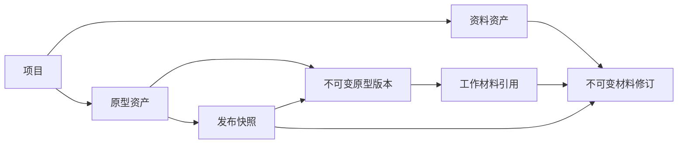

# Prototype Hub 产品规划与 PRD

文档版本：1.0 · 日期：2026-09-07 · 状态：建议评审稿  
评估基线：当前仓库提交 `e791735` 及工作区源码。本文描述的新增能力均为规划，不代表已经实现。  
配套文件：[迭代路线与需求清单](/Users/davidduan/Desktop/backend/prototype-hub/docs/PRODUCT_ROADMAP.md)

## 1. 产品判断

**项目方向合理，现有实现已形成可继续演进的基础。下一阶段应把“原型版本 + 版本附件”完善为“以原型为入口、可复用且可追溯的本地项目资产库”。**

它要帮助用户回答四个问题：这个项目有哪些资料；现在该看哪个版本；当时的原型配套的是哪份文档和数据；两个阶段究竟改了什么。

目前已经具备 HTML/ZIP 原型导入、隔离预览、版本时间线、预览版/发布版切换、材料批量上传、Office 转 PDF、正文搜索和材料回收站。无需推翻现有架构，主要缺口在资产之间的关系、发布记录和数据取回流程。

建议先做以下五件事：

1. **材料可以独立保存。** 没有原型时也能归档需求文档、调研 PDF、数据表和图片。
2. **材料可以被多个版本引用。** 一份接口文档更新后生成自己的新修订，历史原型继续引用旧修订。
3. **发布时固定整套内容。** 明确保存原型与材料的组合，后续编辑不改变当时发布的记录。
4. **资料可以找准、取回和恢复。** 搜索直达命中的历史版本，支持原型下载、项目导出和经过验证的备份恢复。
5. **比对分层交付。** 先比较文件清单和两个历史版本，再做页面视觉、文档结构和实时监听。

例如：“订单后台 v5”使用《订单需求》修订 2 和《字段字典》修订 3。即使两份材料后来都更新了，仍应能一键找回 v5 当时的完整组合。这是本产品最应优先形成的价值。

## 2. 评估依据与现状

### 2.1 本次评估范围

已核对 README、架构文档、Prisma 模型、项目/资产/版本/预览页面、API、文件处理 Worker 和部署配置。默认管理入口 `localhost:8080` 在本次检查时未能连接，因此以下是**基于源码的产品审视**，不包含真实用户可用性测试、运行性能测试或文件转换保真度测试。

“未实现”指在本次检查的模型、接口和页面中未见相应产品能力；不会把 README 中的愿景当成已经通过验收的功能。证据索引见第 12 节。

### 2.2 能力审视

| 能力 | 当前情况 | 产品判断与下一步 | 证据 |
| --- | --- | --- | --- |
| 项目与原型组织 | 项目 → 原型资产 → 原型版本 → 材料 | 层级适合原型迭代；需要补充独立的项目资料库 | E1、E2 |
| 原型版本 | HTML/ZIP 原件不可覆盖，版本号自动生成 | 保留这一原则；补上不复用的编号、明确的比较基线和原件下载 | E3 |
| 预览版与发布版 | 两个指针均指向可用的原型版本 | 适合区分候选与稳定原型；当前尚未固定配套材料 | E1、E3 |
| 材料管理 | 多格式预览、分类、标签、原件下载、回收站 | 已有实用基础，应提升为可复用、可修订的资料资产 | E4、E5 |
| 材料修订与复用 | 原件不可覆盖；每条材料只属于一个原型版本 | 重复上传只是独立文件，尚不能表达“同一文档的新修订” | E1、E4 |
| 发布历史完整性 | 发布后仍可新增、编辑、删除工作空间中的材料 | 只能保证原型文件不可变，尚不能保证整套交付物不可变 | E3、E4 |
| 搜索 | 可搜索原型和材料正文、名称、标签 | 原型结果展示最新版本，即使命中的是历史正文；缺少命中解释和分页 | E3、E6 |
| 数据资产 | 支持 Excel，但以 PDF 方式展示 | 适合阅读归档；尚无 CSV/JSON/SQL 材料支持、表格结构或数据差异语义 | E4、E5 |
| 图片资产 | PNG/JPEG/WebP 可预览 | 基础可用；缩略图浏览、尺寸筛选、OCR 等仍可迭代 | E4、E5 |
| 删除与恢复 | 材料软删除保留 30 天；上层对象直接级联删除 | 删除项目/原型/版本可能绕过材料恢复期，需要统一生命周期 | E3、E4 |
| 数据可携带性 | 材料可下载；文档有手动备份说明 | 未见原型源包下载及项目完整导出的产品入口，备份恢复也尚未产品化 | E3、E7 |
| 比对基础 | 已有原包校验和、文件路径和大小清单 | 尚无文件级内容哈希、页面映射、比对任务和结果界面 | E5 |
| 本地与离线 | 服务和文件可部署在本机，Office 本地转换 | 无需云端转换是优势；原型可引用 HTTPS 资源，不能直接承诺所有原型断网可用 | E5、E8 |
| 协作 | 用户所有权校验，界面为个人工作区 | 当前按个人工具理解合理；团队成员、角色和审阅流程需另行设计 | E1、E3 |

### 2.3 已发现的具体产品风险

**版本号可能重复用于不同历史内容。** 当前编号取现存版本最大值加一。依据代码推演：删除未被指针引用的最高版本 v5 后再上传，可能再次得到 v5。应使用单调增长且不回收的序号；这项判断尚未通过运行时复现。[E3]

**“相较上一版本”缺少实际关系。** 页面通过 `versionNo - 1` 展示上一版本，不能表达“从 v2 改出的 v5”，也无法应对中间版本已删除。应保存用户选择的基线 ID。[E2、E3]

**“搜到了”不等于“找对了”。** 某关键词只出现在 v2 时，当前原型搜索结果仍可能展示 v5。用户需要看到命中 v2 的片段，并直接进入 v2。[E3、E6]

**“删除成功”不一定意味着磁盘已释放。** 上层删除先移除数据库记录，再尝试清理对象；清理失败缺少面向用户的跟踪状态。应保留可重试的清理任务，释放容量以实际清理结果为准。[E3、E4]

**本地部署与完全离线是两项承诺。** 当前 CSP 禁止 `connect-src`，但允许部分脚本、样式、图片加载 HTTPS 资源。断网时外部字体或脚本仍可能丢失；“禁止全部外联”也不是当前实现。[E8]

## 3. 定位、用户与范围

### 3.1 产品定位

**面向个人产品工作者的本地原型与项目资料管理工具，提供可靠归档、上下文关联、版本追溯和渐进式差异比较。**

当前规划默认：主要由你本人使用；文件导入后由平台保存副本；日常核心流程不依赖公网；首要支持现有 HTML/ZIP 原型与常用文档。个人之外的团队需求，以及“实时比对”的具体含义，作为可调整假设保留。

| 典型任务 | 用户需要完成的结果 | 产品应提供的帮助 |
| --- | --- | --- |
| 准备一个新项目 | 先收集调研、需求和样例数据 | 无原型也可上传资料，之后再关联 |
| 整理一次迭代 | 原型与本次 PRD、接口说明、字段表放在一起 | 版本工作空间、引用既有材料、变更说明 |
| 准备评审或交接 | 明确当前稳定版本及其配套资料 | 发布快照、固定入口、整套导出 |
| 回顾历史决策 | 找到某个版本当时使用的内容 | 历史快照、材料修订、操作记录 |
| 判断改动范围 | 快速知道新增、删除和修改的位置 | 文件差异、页面并排、后续结构化比对 |

### 3.2 有意识控制的范围

首个稳定个人版本聚焦“导入 → 组织 → 预览 → 关联 → 发布 → 搜索 → 导出/恢复”。Office 编辑继续使用本地原生软件，平台负责归档新修订。

以下能力暂列后续：多人同时编辑、Git 分支合并、任务看板、完整设计工具、数据库连接与持续同步、全量数据治理、视频编辑，以及跨设备双向同步。以后是否投入，取决于实际使用中的阻塞。

数据资产第一步指**与原型相关的数据文件及说明**，例如字段字典、指标口径、样例 CSV、JSON、SQL 脚本。SQL 作为文件保管与查看，不在平台中执行；对生产数据库的查询、调度、血缘治理另立需求。

Axure 官方的团队项目历史同样以保存当时项目状态、查看说明和下载历史修订为核心。这说明“可找回的历史”值得优先建设；本项目的差异化方向是本地保管与跨文件类型的上下文关联。此处是产品判断，并非对竞品全部能力的比较。[Axure 项目历史](https://docs.axure.com/axure-rp/reference/team-project-history/)

## 4. 信息架构与核心概念

### 4.1 建议导航

```text
工作台：全局搜索、最近打开、待处理/失败任务
项目
  ├─ 概览：说明、当前发布、最近活动
  ├─ 原型：原型资产 → 版本时间线 → 版本工作空间
  │                                  ├─ 原型预览
  │                                  ├─ 工作材料（可继续整理）
  │                                  └─ 发布记录（已固定）
  └─ 资料库：全部资料、类型/标签筛选、修订历史、被引用位置
全局资料视图：跨项目检索，保留每份资料的归属
回收站
设置：存储与容量、备份与恢复、运行状态
```

全局资料视图汇总项目内资料，首期不额外引入另一套全局所有权。跨项目复用先通过显式复制并记录来源解决；同项目内直接引用。个人版核心行为控制在项目、原型、资料三个入口中。

### 4.2 区分三种“版本”

| 概念 | 例子 | 何时产生 | 内容规则 |
| --- | --- | --- | --- |
| 原型版本 | 订单后台 v5 | 导入新的 HTML/ZIP 工件 | 原包、入口路径、内容清单不可覆盖 |
| 材料修订 | 《订单需求》修订 2 | 为同一份资料上传新内容 | 每次修订保留独立原件与校验和 |
| 发布快照 | 发布 r3：原型 v5 + 需求修订 2 + 字段表修订 3 | 用户确认一次发布 | 固定原型、材料修订、展示名称与发布说明 |

“预览版”仍是当前用于验收的原型版本；“当前发布”改为指向某份发布快照。原型序号 v、材料修订号、发布编号 r 分开显示，不要求保持一致。

材料只有修订 1 时弱化修订标签；发布编号在发布记录中展示，减少日常界面的概念负担。用户新增资料时只需填写名称，分类和标签可以后补。

### 4.3 关联规则



1. 一份资料可以先独立存在，再关联一个或多个原型版本。
2. 引用绑定确定的材料修订。新修订上传后提示“有更新”，用户主动升级引用，历史引用不会自动跟随最新内容。
3. 工作材料允许增删与更换引用。发布时将选中的引用和展示信息复制到不可变快照，发布后仍可继续整理工作材料，但界面必须明确“尚未发布的资料变更”。
4. 仅修改材料也可创建新发布快照。例如 r3 和 r4 都使用原型 v5，但 r4 使用了新字段表，无需制造内容相同的原型 v6。
5. 回滚当前发布，只切换到某个历史快照，并记录从哪一份切换到哪一份。原型和资料均不覆盖。
6. 一份修订被任意保留中的发布快照引用时，禁止单独永久删除。归档、取消工作引用和物理删除必须是不同操作。
7. 发布快照保存当时的材料名称、分类、标签和发布说明；资料库后来改名不会改变历史展示。管理员补充说明单独留痕。
8. 第一阶段继续使用线性版本历史，另保存比较基线；不把比较基线当作 Git 分支或可合并关系。

## 5. 核心使用流程

| 场景 | 主要步骤 | 成功结果与异常处理 |
| --- | --- | --- |
| 首次归档 | 新建项目 → 拖入原型和资料 → 确认文件角色 → 查看处理结果 | 一次完成原型/资料导入；单文件失败可独立重试，成功项保留 |
| 先有资料后有原型 | 项目资料库上传 → 补名称和标签 → 后续创建原型 → 引用资料 | 不必上传空白 HTML 才能保存文档 |
| 迭代原型 | 选原型 → 导入新版本 → 选比较基线 → 填变更说明 → 选择沿用的材料引用 | 自动带出上一工作空间的材料候选；已选修订固定，新增版本不改旧版 |
| 更新文档 | 打开资料 → 下载/本地修改 → 上传为新修订 → 选择需要升级的工作引用 | 老修订与历史发布仍可读取；同名文件不自动当成新修订 |
| 发布与回退 | 检查原型和材料 → 创建快照并设为当前发布 → 必要时切回旧快照 | 用户看到具体原型版本与资料清单；重复提交不会生成重复发布 |
| 找回与交付 | 搜索词 → 查看命中片段和版本 → 打开原件/预览 → 导出快照 | 可解释为何命中，导出包包含准确的版本关系 |
| 比较历史 | 选基线 A 与目标 B → 看文件清单 → 打开对应页面 → 保存报告 | 新增、删除、变更和未能比较的项目分别展示 |

## 6. 功能需求与验收标准

优先级定义：**P0** 为稳定个人版不可缺少的可信归档能力；**P1** 为随后改善查找和比较效率的能力；**P2** 为按真实需求投入的扩展。P0 分 M0、M1 两个里程碑交付，避免一次性大改。完整排期依赖见配套路线图。

### FR-01 项目资料库与独立归档 · P0 / M1

支持在项目中直接上传资料；资料库可按文件类型、分类、标签、更新时间和引用状态筛选。沿用“产品、数据、后端、前端、测试、设计、其他”作为可选初始分类，不强制按照岗位建七层文件夹。

- 验收：没有任何原型的项目可以上传 PDF、DOCX、XLSX 和图片并检索、下载。
- 验收：一份材料可关联两个原型版本；资料详情显示所有引用位置，取消其中一个引用不删除原文件。
- 验收：从版本工作空间上传文件时，自动建立资料资产与工作引用，用户无需在两处重复操作。

### FR-02 导入、重复识别与处理反馈 · P0 / M0、M1

沿用批量上传，补充明确的阶段状态：正在上传、原件已保存、正在生成预览、可预览、预览失败。原件保存状态与预览状态分开。上传重试应识别同一次提交；用户明确要求“再次归档”时才新建记录。

- 验收：同一批 10 个文件中 2 个失败，另外 8 个保持成功；重试失败项不重复创建成功项。
- 验收：同项目同校验和文件提示“已存在”，提供引用已有资料或另建资料的选择；文件名相同不自动合并。
- 验收：Office 转换失败后仍可下载原件；界面给出可执行的重试/重新上传提示，不只展示内部异常。
- 验收：原型找不到入口时展示候选 HTML 路径；确认前可修正导入配置，正式版本生成后入口仍不可覆盖。

### FR-03 原型版本与基线 · P0 / M0

保留自动编号，增加可选业务名称、基线版本和变更说明。默认比较基线为上传时最近的成功版本，允许改选同一原型的其他成功版本；首次上传为空。

- 验收：删除最高版本或出现上传失败后，下一次正式分配的编号仍不复用；允许有编号缺口。
- 验收：从 v2 演进得到 v5 时，可记录“基于 v2”；页面按真实关联展示，不能用编号减一替代。
- 验收：基线被归档仍能定位；若未来允许永久清理，则保留不可复用的身份记录，并显示“基线内容已清理”。
- 验收：每个版本都能下载最初上传的 HTML/ZIP，下载文件哈希与保存时一致。

### FR-04 材料修订与引用 · P0 / M1

资料资产具有稳定身份；上传新内容可选择“新资料”或“已有资料的新修订”。新修订可填写变更说明。工作引用可手动升级、降级，历史发布引用保持固定。

- 验收：某资料修订 1 被 v1 和 v2 引用，上传修订 2 并只升级 v2 后，v1 仍读取修订 1。
- 验收：改名或修改标签不新增内容修订；替换文件内容必须新增修订。
- 验收：上传相同内容时提示无内容变化，不静默创建无意义修订；确需单独归档时允许明确操作。
- 验收：资料类别与文件格式分别保存；“数据”类可以同时包含 XLSX、字段说明 PDF 和 CSV。

### FR-05 发布快照与回滚 · P0 / M1

点击发布后展示原型版本、已选材料及具体修订、变更说明。用户确认后创建快照并更新当前发布。允许零材料发布；原型必须可预览，材料原件必须完整。材料预览失败可以明确标记后纳入发布，不阻止原件交付。

- 验收：发布 r1 后新增、改名、更新或取消工作材料，不改变 r1 的清单、展示信息和文件哈希。
- 验收：只更新材料可发布 r2，r1、r2 指向同一原型版本且材料修订不同。
- 验收：回退到 r1 后，当前发布的原型与材料同步切换；操作记录包含时间、操作者及前后快照。
- 验收：双击发布只产生一个快照；发布期间引用被另一操作改动时，要求重新检查清单，不生成混合状态。
- 验收：发布快照固定入口与“当前发布”入口分开；前者始终查看同一快照，后者跟随切换。

快照能力上线前，界面应将当前功能明确标为“当前发布原型”，并提示其材料仍是工作资料，避免误认为整套内容已固定。

### FR-06 预览与格式支持 · P0 保留 / P1 扩展

采用逐格式的能力表，明确保存、预览、检索、比较的不同支持程度。

| 格式 | 当前支持 | 建议下一步 | 能力边界 |
| --- | --- | --- | --- |
| HTML/ZIP | 保存、解包、隔离预览、HTML 文本搜索 | 原件下载、入口选择、依赖检查、文件差异 | ZIP 是已导出的静态原型；不承诺运行任意源码工程 |
| PDF | 原件、预览、提取文本 | 页数/缩略图、页面差异 | 扫描件没有 OCR 时只搜索名称和标签 |
| DOC/DOCX、PPT/PPTX | 转 PDF 预览并提取文字 | 显示转换说明；后续文档差异 | 保留原件；复杂排版不承诺完全一致 |
| XLS/XLSX | 转 PDF 预览并提取文字 | M2 增加工作表/单元格浏览，M3b 做结构比较 | PDF 预览不代表保留公式、筛选、隐藏表等交互能力 |
| PNG/JPEG/WebP | 图片预览 | 尺寸、缩略图网格、视觉比对 | OCR 与相似图检索后续按需要加入 |
| Markdown/TXT | 安全预览与正文搜索 | 文本差异 | 当前文本输入限 UTF-8 |
| CSV/JSON/SQL | 未列入当前材料格式 | M2 增加保存、受限预览与内容搜索 | 明确编码、解析失败原因；不执行 SQL 或脚本 |
| SVG/GIF、设计源文件、其他附件 | 部分可作为原型包内文件；非通用独立材料支持 | P2 按样本扩充允许保存的格式，提供下载兜底 | “允许保存”不等于“能够预览/比较”；源文件与可预览导出包分开 |

- 验收：转换预览明确标明类型，并始终提供原件下载；不支持的预览显示原因。
- 验收：已导入且依赖完整的原型及文档可在断开公网时读取；外部资源依赖有明确提示。
- 验收：保留现有隔离预览机制，新格式不能通过直接执行脚本实现“万能预览”。

### FR-07 全局搜索与准确定位 · P0 修正 / P1 完善

M0 先修正历史命中定位；M1 纳入独立资料与修订。M2 再增加类型、项目、标签、时间、发布状态筛选，分页和命中片段。排序优先考虑精确名称、标签、正文匹配，随后才考虑时间。

- 验收：关键词仅在 v2 出现时，结果明确展示并直达 v2，不用最新 v5 代替。
- 验收：资料结果显示项目、名称、修订、命中片段和引用位置；同一修订被多次引用时聚合展示。
- 验收：默认搜索当前资料修订和有效原型版本，可显式展开历史资料修订；回收站默认排除。
- 验收：超过 100 条仍可分页查看；网络或服务错误显示“搜索失败”，不能当成“没有结果”。

### FR-08 回收站、归档与存储管理 · P0 / M0、M1

项目、原型、版本和资料采用一致的软删除策略，默认恢复期沿用 30 天。归档表示从常用列表隐藏，恢复期规则不适用于普通归档。父级进入回收站时保留原有关系；恢复父级不能意外恢复此前已单独删除的子项。

- 验收：删除项目后能整体恢复原型、版本、材料和发布关系；删除前展示影响的对象数和容量。
- 验收：删除单个工作引用不会删除资料；被保留的发布快照引用的原型或修订不能单独永久删除。
- 验收：永久删除整个项目须明确列出其中也会销毁的历史快照；同项目内闭合清理，不能影响外部有效引用。
- 验收：物理清理失败保留任务和可重试状态；容量显示区分原件、衍生预览、回收站、待清理空间。
- 验收：M1 复用后，同一修订在项目内只计算一次原件存储；引用数另计。单文件默认仍为 100MB，原有每版本 100 项/1GB 在迁移中保留兼容并重新标注口径，调整上限通过设置和实测决定。

### FR-09 导出、备份与恢复 · P0 / M0、M1

分别提供两种结果：**交付导出**用于拿走某个项目/快照的原型、材料和说明；**完整备份**用于恢复平台，包括数据库、原件和必要配置。两者不能混用名称。

- 验收：导出快照包含原型源包、关联材料原件和清单，清单包含项目/原型/版本/修订 ID、原始文件名、相对路径、大小和校验和；重名文件不覆盖。
- 验收：导出不带临时签名 URL、登录会话或密钥。文档可直接用原生软件打开；复杂原型如需 HTTP 服务，提供清晰的本地运行说明，不承诺所有 HTML 双击即完整运行。
- 验收：备份数据库与对象集合来自一致性边界；首期可短暂暂停写入及 Worker 清理，成功或失败后均恢复服务。
- 验收：在独立空环境恢复一份真实样本备份，项目数、引用关系、原件哈希及抽样预览一致，才显示“恢复已验证”。
- 验收：导出/备份任务显示范围、进度、完成位置和失败原因；部分失败不能显示完整成功。

首期完整备份可用已验证的本地命令和操作说明交付，后续补图形界面；仅复制数据库或仅复制对象存储不算完成此需求。

### FR-10 操作记录与运行状态 · P0 基础 / P1 完善

记录导入、创建修订、修改引用、发布、回滚、删除、恢复和导出事件。个人版用于自查；不预先建设复杂审批流。

- 验收：发布和回滚能查看时间、操作者、对象及前后目标；记录不依赖当前显示名称推断历史。
- 验收：管理端能分辨“原件已保存但预览失败”和“原件未保存”，后台任务重启后可恢复或明确失败。
- 验收：展示可用磁盘/存储占用、失败任务和最近备份结果；技术日志保留在详情中，主界面用用户能采取行动的说明。

### FR-11 历史版本比较 · P1 / M2、M3

默认同一原型内任选两个成功版本，A 为基线、B 为目标；支持交换 A/B。发布快照比较同时包含原型差异和材料清单/修订变化。具体分层与验收见第 7 节。

### FR-12 本地工作目录实时对照 · P2 / M4-A

显式选择一个本地目录和一个历史基线，检测稳定的文件变化并生成临时比较结果；正式版本仍由用户主动保存。目录监听需要独立验证宿主机访问、权限、重命名、休眠恢复和原子保存行为。

- 验收：保存文件后，在小型样本目标范围内及时提示变化；保存过程中的中间文件不产生正式版本。
- 验收：显示监听目录、基线、上次检测时间和暂停状态；无变化时不重复创建比较任务。
- 验收：删除工作目录、丢失权限或设备休眠后明确显示离线/需重新连接；历史工件和历史发布仍可访问。
- 验收：正式保存新版本时再次读取一致的目录快照，若与屏幕上的临时结果不同，标明需要重新比较。

## 7. 比对能力的专项规划

### 7.1 明确两条不同维度

| 维度 | 定义 | 建议 |
| --- | --- | --- |
| 触发方式：历史比较 | 用户选择两个已保存的版本/快照后执行 | 优先交付，可重复验证 |
| 触发方式：实时对照 | 工作目录变化后自动刷新与固定基线的差异 | 后续加入监听与临时工作状态 |
| 运行环境：离线 | 处理与结果查看均在本机完成，不依赖公网服务 | 历史比较首期即按此设计 |
| 运行环境：在线/联调 | 原型需要访问真实服务或远程资源 | 单独管理依赖，结果可重复性较弱 |

实时对照也可以离线运行；“实时”和“离线”不构成二选一。由于需求尚未进一步限定，路线图默认优先实现本地历史比较。

### 7.2 按价值和复杂度分层

| 阶段 | 能力 | 用户得到什么 | 验收边界 |
| --- | --- | --- | --- |
| M2-A | 文件清单比较 | 哪些文件新增、删除、修改；哪些资料升级修订 | 同路径文件以内容哈希判断，不能只比较大小；不同 ZIP 打包时间不应造成内容误报 |
| M2-B | 页面并排查看 | 两个版本的对应页面独立交互 | 同路径默认配对，改名可手动映射；新增/删除页面显示单边空态 |
| M3a | 页面与图片视觉差异 | 并排、叠加、差异区域、变化比例 | 固定渲染环境、视口、字体和等待规则；加载失败显示“未完成比较” |
| M3a | 文本/PDF 基础差异 | 段落变化、页面变化 | 页码配对是初始策略；插页和重排需说明，扫描 PDF 无文本时降级视觉比较 |
| M3b | Word/Excel 结构差异 | 文档段落/表格及工作表/单元格变化 | DOCX 先于旧 DOC；XLSX 先于旧 XLS；超出支持范围明确降级 |
| M4-A | 工作目录实时对照 | 边修改边查看差异 | 先提示文件变化，再按需刷新视觉结果；不自动发布 |

当前 Worker 的文件清单只有路径与大小，原包有整体哈希。因此 M2 前需要补充逐文件哈希。比较摘要至少包含新增、删除、修改、相同、未能比较五类结果。[E5]

文件重命名初期按删除加新增展示，哈希相同可提示“可能移动/重命名”；未经确认不宣称语义对应。多页 HTML 默认按路径匹配；单页应用或交互状态需要用户提供路由/状态清单，第一版不承诺自动遍历所有弹窗和业务流程。

### 7.3 防止视觉误报

所有可自动比较的页面应记录：A/B 内容标识、页面路径、视口、浏览器/字体环境版本、等待条件、遮罩规则、比较工具版本和时间。固定环境下采集两端，允许忽略时间、随机数据、闪烁光标等已知动态区域，遮罩必须可见且可撤销。

Playwright 官方指出，操作系统、浏览器、字体和运行条件会影响截图结果，并建议在相同环境生成与比较基准；也提供屏蔽动态内容的能力。本项目据此建议采用固定的本地截图环境。[Playwright 视觉比较](https://playwright.dev/docs/test-snapshots)

“变化像素占比 3%”只能表示图像变化程度，不能表示“需求完成度 97%”或“业务影响 3%”。页面未加载、字体缺失、比较被跳过都不能算没有差异。结果提供用户复核入口。

当前原型在跨来源 sandbox iframe 中运行。并排独立查看可以先做；同步滚动、同步点击和读取 DOM 需要受控桥接或隔离的浏览器自动化，不能假定父页面可直接操作两边 DOM。该约束来自现有实现与浏览器同源规则。[E2；MDN 同源策略](https://developer.mozilla.org/en-US/docs/Web/Security/Defenses/Same-origin_policy)

### 7.4 文档与数据比对

**PDF/Word：** 优先提供并排与提取文本差异，再做段落/表格定位。文本相同但版式不同必须保留视觉差异；不能把转 PDF 后的差异称为完整的 Word 修订追踪。密码文件、损坏文件、复杂嵌入对象和无法提取的文本分别报告。

**Excel：** 比较工作表增删、单元格值和公式表达式；格式差异作为可选层。第一版按工作表名与单元格坐标匹配，明确提示插行/排序可能造成连锁变化；针对数据表可让用户选主键再比较行记录。隐藏工作表需纳入清单；公式自身变化与缓存显示值变化分别显示。禁止为比较而执行宏或刷新外部连接。

**CSV/JSON：** 明确编码、分隔符、空值/空串、数字精度和排序策略；大文件使用限制范围、分页或异步任务，不将截断后的比较显示为完整结果。JSON 对象键顺序可忽略，数组默认保留顺序，规则在报告中说明。

### 7.5 实时能力的依赖

浏览器目录访问存在用户交互、授权和兼容性条件，不能假定网页可以持久在线监听任意本地目录。MDN 的目录选择接口明确列出这些约束。[MDN 目录选择接口](https://developer.mozilla.org/en-US/docs/Web/API/Window/showDirectoryPicker)

对当前 Docker 部署，容器也不会自动看到宿主机目录。实时功能先做小规模验证，再选择显式目录挂载、本地辅助进程或桌面壳；不要仅为“未来可能需要实时”立即重写整个应用。

比较任务还应具备排队、取消、超时、失败重试和缓存。缓存键以两端不可变内容及比较配置为依据；临时工作目录必须先生成内容快照再计算，避免边写边比。

## 8. 质量目标与效果验证

以下数值均为**建议验收目标，不是当前实测结果或交付承诺**。M0 先记录基线，再根据你的设备和文件样本调整。

| 指标 | 建议目标 | 测量方式 |
| --- | --- | --- |
| 找回正确资料 | 20 个已知答案的检索任务中至少 18 个在 30 秒内找到正确版本 | 覆盖历史原型、材料修订、中文关键词和扫描 PDF 空态 |
| 完整发布可追溯 | 抽检 10 个发布快照，原型、资料修订、名称和哈希全部吻合 | 更新资料、改名、切换发布后重复核对 |
| 预览成功率 | 合法、无密码且在支持范围内的常用样本至少 95% | 各格式分别统计；保存成功率与预览成功率分开 |
| 搜索响应 | 参考规模下 P95 小于 2 秒 | 本机服务已启动，包含真实中文正文；不只测空库 |
| 文件差异正确性 | 预设新增/删除/同尺寸改动/重新打包等样本全部分类正确 | 以可人工核对的固定文件清单为答案 |
| 视觉比较稳定性 | 10 个确定性页面对自身重复比较无超过阈值的误报 | 固定环境；另设动态页面样本检验降级提示 |
| 备份恢复 | 验收样本的对象关系与原件哈希 100% 一致 | 在独立空环境中恢复并打开样本 |
| 日常效率 | 连续两周记录实际整理与找回任务，耗时相对基线下降至少 30% | 个人使用以具体任务耗时评估，不采用虚构的 DAU 目标 |

参考压测规模建议从 20 个项目、100 个原型、1,000 个原型版本、5,000 个材料修订开始；机器配置、原件容量与正文大小必须随测试报告保存。大文件/转换任务异步执行，不能阻塞导航与搜索。若实际规模更小，先测真实规模，再验证增长余量。

本地核心读写、检索、文档转换和历史比较不依赖云端服务。首次安装的镜像、字体、浏览器依赖需预先准备；“装好后断网使用”和“从零离线安装”分别验收。需要外部服务的原型应列出依赖和受限状态，不能用放开全部网络访问替代兼容性设计。

## 9. 演进方式与数据迁移

保留现有 Web/API/Worker、PostgreSQL 和 S3 兼容存储。当前架构支持异步转换与未来比对，针对个人工具稍有运维成本，但没有证据表明需要重写或提前引入新搜索引擎。

建议概念映射：保留 Project、PrototypeAsset、PrototypeVersion；增加资料资产、材料修订、工作引用、发布快照/条目及操作记录。文件内容复用可以逐步做，第一步即使尚未物理去重，也应先建立正确的逻辑引用关系。

迁移规则：

1. 先完成一致性备份与恢复演练，再对副本迁移；迁移失败可切回旧数据及旧应用版本。
2. 每条旧 VersionMaterial 初始映射为一份资料的修订 1，并建立原版本工作引用；保留来源 ID、时间、名称、标签、删除状态和原件哈希。
3. 同名文件绝不自动合并为同一资料。相同哈希只作为重复候选，语义合并由用户选择，避免将不同用途的文件误并。
4. 保持旧版本 URL 与材料链接可定位，必要时通过兼容映射跳转；原件不必在首轮迁移中搬迁路径。
5. 旧 releaseVersionId 只证明当前发布原型。无法还原历史发布时的材料清单，**不得伪造历史快照**。可创建标注“迁移时归档”的当前快照，使用迁移时间并记录来源；曾被删除的内容也不能凭空恢复。
6. 新发布指针指向快照，兼容旧入口时从快照派生原型版本，避免维护两份可独立变化的当前发布事实。
7. 版本序号以可恢复的历史最大值初始化永久计数器，并保留删除身份记录；迁移前已经丢失的最高编号无法仅凭现有数据库保证找回，须检查备份/日志并在迁移报告说明。
8. 逐文件哈希和搜索索引可后台补建；未完成时标明能力暂不可用，不能阻断原件下载。

迁移验收：对象数量与映射对应、原件哈希一致、删除状态保留、引用无悬空、旧链接可访问、回收站可恢复、当前发布原型未改变。新旧对象数量不一定相同，应按迁移映射核对，不能只比较记录总数。

## 10. 推荐迭代顺序

| 里程碑 | 主要结果 | 进入下一步的条件 |
| --- | --- | --- |
| M0 可信归档 | 原型原件可取回，编号/基线/搜索定位准确，删除可恢复，备份已验证 | 通过数据保管验收，现有使用不被迁移风险阻断 |
| M1 资产关系与发布 | 独立资料、材料修订、跨版本引用、完整发布快照 | 能真实重现一次迭代的原型与整套资料 |
| M2 查找与基础比较 | 资料浏览/筛选、数据文件基础支持、文件差异、页面并排 | 查找任务改善，文件差异答案可核验 |
| M3a 视觉与文档基础比较 | 页面/图片差异、文本/PDF 差异、可保存的比较报告 | 误报可控、失败可识别、结果可复核 |
| M3b 数据结构比较 | DOCX/XLSX 等结构比较与规则说明 | 针对真实表格/文档样本通过专项验收 |
| M4 按需求分支 | A：目录实时对照；B：小团队共享；C：OCR/自动整理 | 连续使用证明存在相应高频问题，再投入 |

不将日历日期写成承诺；研发人数、投入比例和真实文件样本尚未确认。每个里程碑结束都可作为一个完整可用版本，详细任务与范围削减方案见路线图。

## 11. 待验证假设与范围调整

| 假设 | 当前默认 | 如果事实不同，如何调整 |
| --- | --- | --- |
| 用户范围 | 个人先用 | 若立即多人共用，成员/角色/共享范围提前到 M1 前评审 |
| 文件管理方式 | 导入副本，平台保管 | 若必须原地管理本地目录，提前做目录访问与断连验证，仍保留归档快照 |
| 原型来源 | 可导出的 HTML/ZIP | 若主要为特定工具源文件，先验证该工具导出兼容性与原件关联方式 |
| 比对首要目标 | 已保存的原型历史 | 若最痛的是 Excel/Word，M3b 可在 M2 基础后优先于页面视觉比较 |
| 数据规模 | 个人项目、中小型文档 | 若大量超 100MB 数据集，重新设计流式导入、预览范围和容量策略 |
| 离线含义 | 安装依赖后断开公网使用 | 若要求从零离线安装，增加离线分发包与升级验收 |

这些是假设记录，不阻塞当前 PRD 的使用；收到偏好后，应更新优先级与验收范围，而不是把所有分支同时加入首版。

## 12. 源码证据索引

以下链接对应评估时的代码位置；后续改动可能使行号发生变化。

| 编号 | 来源 | 对应判断 |
| --- | --- | --- |
| E1 | [Prisma 模型](/Users/davidduan/Desktop/backend/prototype-hub/packages/db/prisma/schema.prisma:57) | 项目、原型版本、单版本材料关系；当前没有独立材料修订和发布快照模型 |
| E2 | [版本工作空间](/Users/davidduan/Desktop/backend/prototype-hub/apps/web/app/versions/[id]/page.tsx:228)、[预览容器](/Users/davidduan/Desktop/backend/prototype-hub/apps/web/app/viewer/[id]/page.tsx:1) | 工作空间材料操作、上一版本文案、iframe 隔离 |
| E3 | [原型 API](/Users/davidduan/Desktop/backend/prototype-hub/apps/api/src/server.ts:265)、[上层删除](/Users/davidduan/Desktop/backend/prototype-hub/apps/api/src/server.ts:142) | 编号计算、版本元数据、发布指针、搜索、删除；接口中未见原型源包下载 |
| E4 | [材料 API](/Users/davidduan/Desktop/backend/prototype-hub/apps/api/src/material-routes.ts:69)、[格式白名单](/Users/davidduan/Desktop/backend/prototype-hub/apps/api/src/material.ts:17) | 上传、材料归属、预览/原件下载、配额、回收站、格式范围 |
| E5 | [原型处理与清单](/Users/davidduan/Desktop/backend/prototype-hub/apps/worker/src/worker.ts:24)、[材料转换](/Users/davidduan/Desktop/backend/prototype-hub/apps/worker/src/material.ts:1) | 整包校验和、文件路径/大小清单、Office 等转换 |
| E6 | [首页与搜索结果](/Users/davidduan/Desktop/backend/prototype-hub/apps/web/app/page.tsx:1) | 两组搜索、最新版本显示、缺少命中片段和分页入口 |
| E7 | [README 备份说明](/Users/davidduan/Desktop/backend/prototype-hub/README.md:78)、[架构说明](/Users/davidduan/Desktop/backend/prototype-hub/docs/ARCHITECTURE.md:1) | 手动备份方式与现有架构意图 |
| E8 | [预览响应 CSP](/Users/davidduan/Desktop/backend/prototype-hub/apps/api/src/server.ts:392)、[部署配置](/Users/davidduan/Desktop/backend/prototype-hub/infra/docker-compose.yml:1) | HTTPS 资源策略、本地服务依赖与端口绑定 |
