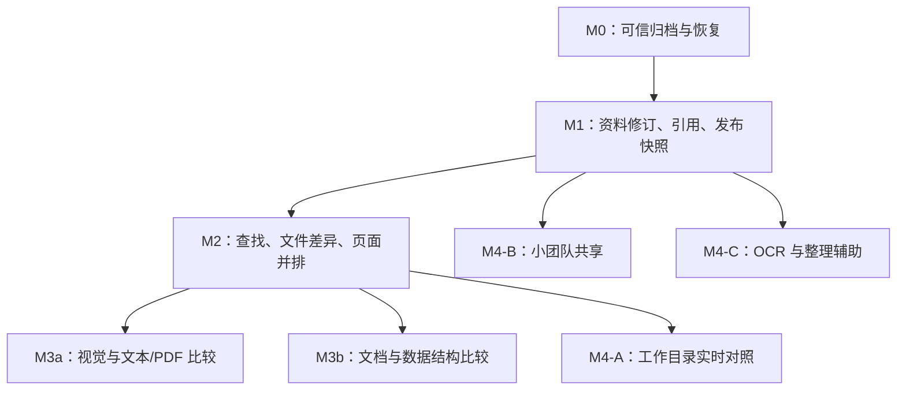

# Prototype Hub 迭代路线与需求清单

日期：2026-09-07 · 状态：建议排期稿  
对应：[产品规划与 PRD](/Users/davidduan/Desktop/backend/prototype-hub/docs/PRODUCT_PRD.md)  
本文任务均为待办建议；不代表本次已实施功能。里程碑编号用于表达依赖和交付顺序，不等同于当前应用版本号。

## 1. 优先级结论

**建议依次投入：数据可取回与恢复 → 资料复用与发布追溯 → 查找与基础比对 → 视觉/结构比对 → 按需要加入实时或团队能力。**

你的项目已有多格式预览和版本管理基础，下一轮最有价值的投入是完善日常使用闭环。先让历史内容可信、资料关系清楚，比对才能得到用户看得懂且可复核的结果。

| 顺序 | 为什么现在做 | 推迟它的代价 |
| --- | --- | --- |
| M0 可信归档 | 已有数据需要随时取回，版本身份和删除规则必须稳定 | 数据越多，误删与版本混淆的修复成本越大 |
| M1 资产关系与发布 | 解决同一份资料反复上传、历史组合不固定的问题 | 比较引擎只能面对散落的文件，难以解释材料演进 |
| M2 查找与基础比较 | 以较清晰的结果帮助定位变化 | 直接上视觉差异会缺少范围、页面对应和可解释性 |
| M3a/M3b 深入比较 | 在真实文件样本上改善评审效率 | 格式复杂度和视觉误报容易吞掉投入，需要限定样本 |
| M4 条件分支 | 实时、协作、智能整理解决不同问题 | 同时展开会引入多套权限、状态和运行约束 |

已有样例足以验证的原型文件比对技术试验，可以在 M0 后提前进行；完整产品仍应在 M1 的版本与材料关系稳定后接入。

## 2. 下一个迭代直接做什么

若现在开始研发，建议先交付下面这一小批，再继续 M0 余项。此批尚不等于整个 M0 完成。

| 次序 | 具体交付 | 用户可见的结果 | 需求 |
| --- | --- | --- | --- |
| 1 | 增加原型源文件下载 | 每个历史版本可拿回最初上传的 HTML/ZIP | FR-03、FR-09 |
| 2 | 固定版本序号分配规则并保留已用身份 | 删除最高版本后不再重复使用编号 | FR-03 |
| 3 | 搜索展示真实命中版本并直接进入 | 搜 v2 的内容，不会被展示成 v5 | FR-07 |
| 4 | 修正文案与状态 | 明确“当前发布原型”；材料区明确仍可整理；保存与预览状态分开 | FR-02、FR-05、FR-10 |
| 5 | 验证一份完整备份的恢复 | 在独立空环境重建项目、文件与关系，留下核对记录 | FR-09 |

这批任务以已有结构为基础。编号改动和恢复验证需要有针对性的检查；文案调整只做相应界面验证。接着处理一致回收站、清理重试和导出，再进入资料模型迁移。

## 3. 里程碑与待办

复杂度用于相对比较：低＝主要在现有流程内补齐；中＝跨页面/API/任务状态；高＝涉及数据迁移、引用一致性或新文件处理能力。这里不把复杂度换算为未经研发确认的工期。

### M0：已有数据值得放心放进来

目标：原型与材料能取回，版本不混淆，误删可恢复，完整备份可验证。

| ID | 待办 | 优先级 | 复杂度 | 依赖 | 验收要点 |
| --- | --- | --- | --- | --- | --- |
| M0-01 | 原型源包下载与版本身份规则 | P0 | 中 | 现有版本模型 | 下载哈希一致；最高版本删除后编号不复用；并发上传无同号 |
| M0-02 | 比较基线字段与历史搜索定位 | P0 | 中 | M0-01 | 基线可选；不以编号减一推断；命中历史版本能直达 |
| M0-03 | 保存/预览状态和失败恢复入口 | P0 | 中 | 现有任务流程 | 原件保存成功不被转换失败覆盖；重试不重复提交成功文件 |
| M0-04 | 项目/原型/版本统一回收站及清理任务 | P0 | 高 | 删除关系梳理 | 父级恢复保持原关系；此前单独删除的子项仍留在回收站；清理失败可重试 |
| M0-05 | 当前版本/项目交付导出 | P0 | 中 | M0-01、M0-04 | 原包、材料、关系清单齐全；重名不覆盖；标记为导出时状态 |
| M0-06 | 一致性备份流程与恢复演练 | P0 | 中 | 数据与对象清单 | 在空环境恢复；对象哈希和引用一致；备份失败后服务恢复正常 |
| M0-07 | 发布含义与操作记录最小补齐 | P0 | 低至中 | 现有发布接口 | 当前仅称发布原型；发布/回滚/删除关键行为可追溯 |

M0-05 不回填过去发布时的资料组合。尚无发布快照时，交付包必须标明采集时间和“导出时工作资料”，并在导出期间固定所选对象集合，避免边导出边变化。

**完成门槛：** 用真实样本完成上传 → 发布原型 → 查找历史 → 下载 → 删除/恢复 → 导出 → 空环境恢复。数据完整性问题未解决时，M0 不算完成。

### M1：资料独立存在，发布组合可追溯

目标：真正覆盖“原型 + 文档 + 数据 + 图片”的资产管理需求，形成稳定个人版。

| ID | 待办 | 优先级 | 复杂度 | 依赖 | 验收要点 |
| --- | --- | --- | --- | --- | --- |
| M1-01 | 资料资产、修订、工作引用的数据模型与迁移 | P0 | 高 | M0-06 | 原件/删除状态/旧链接保留；同名不自动合并；迁移可回退 |
| M1-02 | 项目资料库、独立上传和引用选择器 | P0 | 中 | M1-01 | 没有原型也能保存资料；同资料引用多个版本；全局搜索能找到 |
| M1-03 | 上传新修订、引用升级和内容重复提示 | P0 | 中 | M1-01、M1-02 | 只升级选定工作引用；旧修订可读；同哈希不静默增生资料 |
| M1-04 | 发布快照、当前发布入口和回滚 | P0 | 高 | M1-03、M0-07 | 发布后材料变化不改快照；只更新材料可另发一次；发布提交具有幂等性 |
| M1-05 | 引用保护、容量口径与快照导出 | P0 | 高 | M1-04、M0-04、M0-05 | 在用修订不能单独清除；引用不重复计原件容量；快照导出可核对 |

**关键设计顺序：** 先确定稳定资料身份与修订规则，再确定工作引用和快照引用，最后做页面。不能先把“资料库”做成当前材料列表的一个筛选页，就视为完成模型演进。

**完成门槛：** 构造原型 v1/v2、需求修订 1/2、字段表修订 1，发布 r1/r2；后续改名、更新、取消引用、回滚后，两份历史发布的原件与清单仍保持准确。至少持续使用一个完整迭代周期，再推进大范围比对。

### M2：找得更快，先看清改动范围

目标：改善日常资料浏览，并交付无需复杂视觉引擎的历史比较。

| ID | 待办 | 优先级 | 复杂度 | 依赖 | 验收要点 |
| --- | --- | --- | --- | --- | --- |
| M2-01 | 搜索片段、分页、类型/标签筛选和最近打开 | P1 | 中 | M1-02 | 超过 100 条可继续查看；同修订聚合引用；空结果与失败分开 |
| M2-02 | 图片网格与文档基本属性 | P1 | 中 | M1-02 | 尺寸、格式、页数等可读；列表与网格切换保留筛选 |
| M2-03 | CSV/JSON/SQL 基础归档及 XLSX 表格浏览 | P1 | 高 | M1-03 | 明确编码和预览范围；工作表可切换；不执行脚本、宏或外部连接 |
| M2-04 | 文件哈希清单与快照材料差异 | P1 | 中 | M0-02、M1-04 | 同大小不同内容判为修改；重打包同内容不误报；材料修订变化可定位 |
| M2-05 | 比较入口、页面配对和独立并排预览 | P1 | 中 | M2-04 | A/B 可交换；改名可手动配对；缺失页面有单边空态 |

**完成门槛：** 固定文件差异样例全部判定正确；完成 PRD 中 20 个检索任务的验证。第一版并排预览允许两边独立操作，同步滚动与同步点击不作为此阶段承诺。

若原型差异是当前最紧迫需求，M2-04/05 可以先于 M2-02/03 交付；资料类型扩展仍以真实样本决定范围。

### M3a：页面与文档基础差异可以复核

| ID | 待办 | 优先级 | 复杂度 | 依赖 | 验收要点 |
| --- | --- | --- | --- | --- | --- |
| M3a-01 | 固定环境截图、视觉差异和动态区域规则 | P1 | 高 | M2-05 | 相同确定性页面稳定；视口/字体/等待规则记录齐全；失败不当作无差异 |
| M3a-02 | 文本差异与 PDF 页面并排/差异 | P1 | 中至高 | M2-04 | 插页、重排、扫描件可解释；文本与版式差异分开 |
| M3a-03 | 比较任务历史与离线报告导出 | P1 | 中 | M3a-01/02 | 报告固定 A/B 内容、配置和未比较项；下载后无过期签名依赖 |

**完成门槛：** 用同页重比验证稳定性，用已知变化验证敏感性，再用动态内容和加载失败样本验证降级行为。比较报告必须能回答“比较了哪些内容、按什么规则、哪些部分没完成”。

先覆盖指定入口页和用户勾选页面。任意交互状态自动遍历、完整业务影响判断和 AI 自动验收不进入此阶段。

### M3b：按真实材料投入结构化比较

| ID | 待办 | 优先级 | 复杂度 | 依赖 | 验收要点 |
| --- | --- | --- | --- | --- | --- |
| M3b-01 | DOCX 段落/表格差异与定位 | P1，按需求择先 | 高 | 材料修订模型、文本差异基础 | 段落变动可定位；复杂对象明确不支持或降级；不承诺等同 Word 修订追踪 |
| M3b-02 | XLSX/CSV 数据比较 | P1，按需求择先 | 高 | M2-03、材料修订模型 | 工作表、值、公式分别呈现；排序/插行规则明确；可选主键比较 |

如果你的主要耗时在对照字段表和样例数据，M3b-02 应提前到 M2 后，而不是机械地等页面视觉功能全部完成。旧 DOC/XLS 的支持在新格式样本验证后扩展。

**完成门槛：** 使用真实业务材料建立不少于 10 对可人工核对的样本，覆盖改名、插行、排序、公式、隐藏表、空值和转换失败；对不支持的内容明确报告。

### M4：由使用证据选择分支

| 分支 | 触发条件 | 建议投入 | 暂不扩张的范围 |
| --- | --- | --- | --- |
| M4-A 本地实时对照 | 连续两周反复手动重新打包/上传，且这一步成为主要耗时 | 指定目录监听、变更合并、临时比较、主动保存正式版本 | 不把每次保存变成正式版本；不默认监听整块磁盘 |
| M4-B 小团队共享 | 固定多人查看/维护，账号共用或反复导出成为实际阻塞 | 项目成员、查看/编辑/管理角色、只读分享、操作记录与撤销 | 不立刻做多人实时编辑、分支合并和全套审批系统 |
| M4-C OCR 与整理辅助 | 扫描文档找不到或重复归类的耗时稳定存在 | 本地 OCR、重复候选、标签建议、可人工修订的摘要 | 不把 AI 结论作为历史事实；不默认向外部服务发送资料 |

这些分支可以择一，顺序不限。若团队共用已是当前明确需求，权限范围必须提前，不能等个人版上线后再补访问边界。

## 4. 依赖关系

实时对照的最小形态只依赖文件差异；要自动刷新视觉差异，另外依赖 M3a 的截图稳定性。实时能力不应成为获得基础历史比较的前置条件。

## 5. 样本与效果评估

开始 M0 时整理一份脱敏测试资料集，不必为了产品规划读取全部私人资产。优先由已有业务样本补充，构造文件只用于补足异常边界。

| 样本组 | 建议覆盖 | 用途 |
| --- | --- | --- |
| 原型 | 单 HTML、多页 ZIP、嵌套目录、自定义入口、外部字体/脚本、缺失资源 | 导入和离线兼容性；页面对应 |
| 文档 | 中文 PDF、扫描 PDF、DOCX 表格、长文档、加密/损坏文件 | 正确预览、检索及失败反馈 |
| 数据 | 多工作表 XLSX、公式与隐藏表、CSV 编码、JSON 数组 | 避免把 PDF 预览误当完整数据能力 |
| 版本 | 最高版本删除、同大小改动、重新打包、基于旧版本演进 | 身份、基线与文件差异 |
| 引用 | 同资料跨版本、只升级部分引用、发布后改名/取消引用 | 历史快照不可变 |
| 恢复 | 上层删除、对象清理失败、备份时中断、空环境恢复 | 资料是否真正能找回 |

个人工具优先记录实际任务：整理一次迭代花多久；找回指定历史资料花多久；多少次下载错版本；多少份资料需要重复上传；比较结果中多少项需要人工排除误报。事件记录保存在本地即可，不需要为这些指标预设云端统计平台。

连续两周后只根据实际任务结果调优先级。PRD 中的响应速度和成功率是初始验收目标，设备性能、文件构成和真实基线确定后才能用于承诺。

## 6. 资源有限时怎么减范围

| 可以后移 | 暂时保留的做法 |
| --- | --- |
| 图片 OCR、相似图搜索 | 名称、标签、缩略图查找 |
| 自动化视觉高亮 | 文件差异 + 两边独立预览 |
| Office 原生结构比较 | 原件下载 + PDF/文本基础对照，并说明能力限制 |
| 跨项目直接引用 | 显式复制并记录来源，同项目内复用 |
| 备份管理大界面 | 已验证的完整备份命令、说明和恢复记录 |
| 桌面客户端 | 保留当前 Web/API/Worker，先验证目录访问方案 |
| 全文搜索基础设施升级 | 先完善现有搜索返回语义、索引和分页，再根据实测决定 |

即使缩小范围，也应保留：原件可取回、版本身份不复用、历史发布不被资料更新改变、误删可恢复、备份恢复经过验证，以及比对失败不被伪装成没有差异。这些决定用户是否愿意长期依赖平台。

## 7. 立项前需确定的少量信息

| 信息 | 不影响先做的工作 | 影响的后续选择 |
| --- | --- | --- |
| 个人使用还是立即团队共用 | M0 的原件、编号和恢复 | 权限与共享提前程度 |
| 文件导入保管还是原地目录管理 | 不可变历史工件和材料修订 | 是否提前做本地访问技术验证 |
| 最常用的原型导出工具 | 原型版本与资料关系 | 优先兼容的入口、路由和资源结构 |
| 最需要比较的是页面还是文档/表格 | 文件清单差异与材料修订 | M3a 与 M3b 的先后 |
| 原件数量、最大文件和设备配置 | 基础产品语义 | 容量、性能目标和任务并发 |

默认路线以个人、本地导入保管、历史原型比较优先。偏好未明确时按该默认推进规划，不把未确认的假设当成已确定的用户要求。
